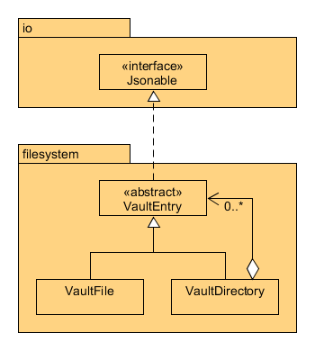

# JVault

JVault is a cross-platform and lightweight encrypted file container utility that offers the portability and flexibility
of securing data on any medium without admin privileges. By emulating a file explorer view of files and directories
stored in an encrypted container (a "vault"), users are able to add and delete files while transparent AES-256
encryption occurs in the background. Encrypted vaults can be stored locally or synchronized with any cloud storage
service. All aspects of the program are open source and client-side.

## Rationale

With the growing prevalence of cybersecurity threats that account for the majority of modern-day breaches of sensitive
data, the necessity of sufficiently secure encryption is essential. While transferring sensitive data over unencrypted
mediums, such as a USB flash drive, is convenient and hassle-free, it unfortunately enables and increases the risk of
unauthorized access to the data. Moreover, existing products that offer file encryption are too inflexible and time
consuming to operate or require admin privileges in exchange for seamless and transparent encryption. I hope to resolve
these limitations and encourage individuals to value data security.

## Features

- Vault can be stored anywhere as a directory
- Encryption key is derived from the password using PBKDF2 and hashed using HMAC SHA-256
- Cryptographically secure 200,000 rounds of iteration, and 16 bytes for salts and IVs generated using Java
    SecureRandom
- AES-GCM algorithm with 256-bit key length and 128-bit tag length
- File contents, file names, and folder names are encrypted

## Security Architecture

- A Vault object handles all filesystem and cryptographic functionality
- The user's password is first strengthened using "PBKDF2WithHmacSHA256" with 16 bytes of salt, which is either randomly
  generated or loaded from the filesystem
- Previously generated salts must be associated and stored inside each vault's filesystem
- Encrypted files are prepended with 16 bytes of a random IV before being written back to disk
- File and folder names are stored in the filesystem

## Deployment

For users who are concerned with protecting sensitive data from unauthorized access when transporting on unencrypted
mediums, JVault provides a lightweight implementation to efficiently encrypt and store files with minor adjustments to
productivity workflow. As an example, students who wish to share local files with a USB flash drive can create a JVault
encrypted container and add files using the utility, rather than directly copying onto the drive.

## User Stories

As a user, I want to be able to:

- create an "encrypted container" (vault) with a password to store files in
- add files to the encrypted vault filesystem
- delete files in the encrypted vault filesystem
- decrypt and save files stored in the vault filesystem into a local folder
- create folders within the vault to organize files
- add and save entire folders to/from the vault
- change the password to a single file or vault

## Instructions for Grader

### Prerequisites *before* running application

- Locate or create a "secret" file on your local drive (it could just be a .txt file containing data you can recognize)
- Identify a folder on your local drive where the application can create a vault in
- Either clone and build the source code yourself, or [download and double-click the standalone runnable JAR file](https://github.students.cs.ubc.ca/cpsc210-2019w-t2/project_d1z2b/releases)

### Interacting with the GUI (continue sequentially)

- #### Create a vault

  - After a window with the title "JVault" has appeared, click the File menu and proceed to **create** a vault with your choice of name, password, and destination folder

- #### Add X to Y / Save application state

  - Click the Edit menu and proceed to **add** a file by selecting that secret file from before. Notice that the name of the file has now appeared in the list of files, and that the encrypted version of the file has now been stored in the "data" folder of the vault on your local drive
  - Note that there is no dedicated button to save the state; all actions trigger automatic saves

- #### Reload application state

  - Exit the application, then relaunch the application. Click the File menu and proceed to **open** the same vault you have created on your local drive, by selecting the folder, clicking open, and entering the exact same password. Notice that the name of the secret file has reappeared in the list

- #### Visual component

  - Locate or create a **JPG** or **PNG** image on your local drive. Click the Edit menu and proceed to **add** that image file to the vault. Then, double-click the added file in the list of files. Notice that a window has appeared that displays that image

- #### Save X from Y

  - Click and select any added file in the list of files. Ensuring that it is highlighted in blue, click the Edit menu and proceed to **save** the file by choosing a folder on your local drive to save the file to. Notice that the decrypted version of the file has now been stored in the folder you have chosen

- #### Delete X from Y

  - Click and select any added file in the list of files. Ensuring that it is highlighted in blue, click the Edit menu and proceed to **delete** the file. Notice that the file has been removed from the list of files as well as from the "data" folder of the vault on your local drive

## Phase 4 Documentation

### Task 2, Option #1: Custom Type Hierarchy

The type hierarchy below exemplifies the composite pattern:

- *VaultEntry* is the component class, *VaultFile* is a leaf class, and *VaultDirectory* is the composite class that
  aggregates multiple *VaultEntry* objects in an *ArrayList*
- This hierarchy reflects a filesystem architecture, where directories can contain files and subdirectories, but files
  cannot contain any children
- All classes that implement *Jsonable* or extend *VaultEntry* must override the *toJson(): JsonObject* method.
  *VaultFile* and *VaultDirectory* provide separate implementations of *toJson(): JsonObject*

### Task 2, Option #2: Robust CryptoProvider Class

- I have designed a custom *CryptoException* class with the sole purpose of generalizing and aggregating exceptions
  thrown by Java crypto operations, such as *InvalidKeyException*, *InvalidKeySpecException*, and *BadPaddingException*
  to say the least
- Instead, the meaning of the specific exceptions above can be extracted based on an operation's context. For example,
  if a *CryptoException* is thrown during a decryption operation, an incorrect password was most likely used
- Most notably, the ***encrypt(input: byte[]): byte[]*** and ***decrypt(input: byte[]): byte[]*** methods throw
  *CryptoException*
- In *CryptoProviderTest*, two methods named *testEncryptDecryptCorrectPassword()* and
  *testEncryptDecryptIncorrectPassword()* test when *CryptoException* is not expected and expected, respectively

### Task 3: Improvements to Design

Principle | Problem Description | Refactored Changes
---|---|---
Reduce coupling | There exists separate places where different *Gson* objects are built for converting *JsonObject*s to JSON strings. This is inconsistent as the way the Gson object is built will affect the resulting JSON strings, which could cause tests to fail or cause a discrepancy between the expected and actual behavior. | Not all classes make use of the *JsonProvider* class, which holds a static final *Gson* object that all classes can use. The *Reader*, *Writer*, and test classes now all use the same consistently-built *Gson* object.
Reduce coupling | The status bar at the bottom of the GUI is updated during an operation, but the error messages are not standardized and are manually set as strings. If another class depends on the contents of the status bar, the inconsistent error messages will cause reliability issues. | The *StatusBar* class now contains an enum of the type of error, and with a more abstract method with parameters that are now more specific with the error description.
